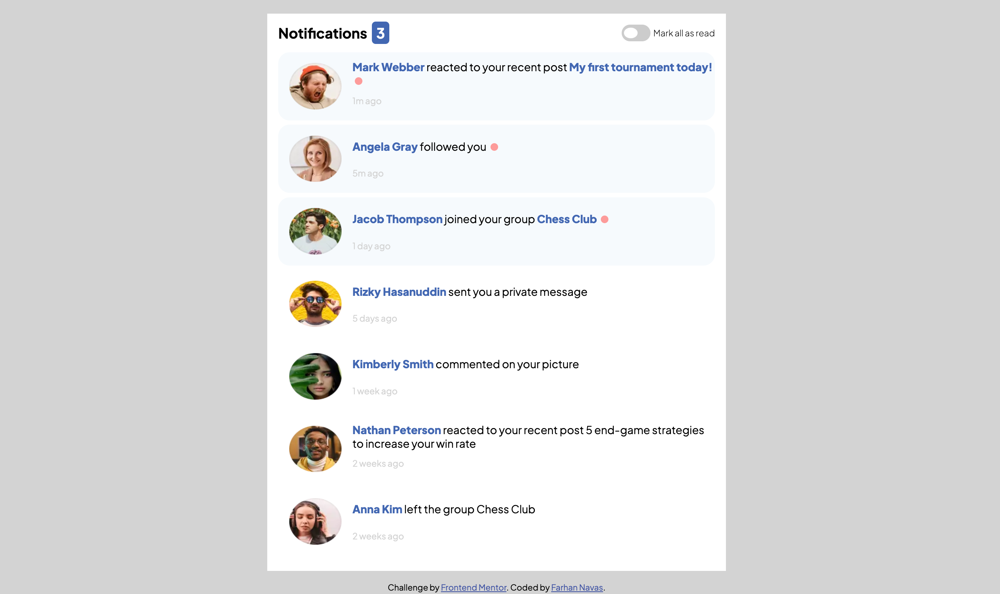

# Frontend Mentor - Notifications page solution

This is a solution to the [Notifications page challenge on Frontend Mentor](https://www.frontendmentor.io/challenges/notifications-page-DqK5QAmKbC). Frontend Mentor challenges help you improve your coding skills by building realistic projects. 

## Table of contents

- [Overview](#overview)
  - [Screenshot](#screenshot)
  - [Links](#links)
- [My process](#my-process)
  - [Built with](#built-with)
  - [What I learned](#what-i-learned)
  - [Continued development](#continued-development)
- [Author](#author)

**Note: Delete this note and update the table of contents based on what sections you keep.**

## Overview

### Screenshot

Above is the screenshot of my solution on desktop mode.

### Links

- Solution URL: [https://github.com/farhan-navas/notifications-page](https://github.com/farhan-navas/notifications-page)
- Live Site URL: [https://farhan-navas.github.io/notifications-page/](https://farhan-navas.github.io/notifications-page/)

## My process

### Built with

- Semantic HTML5 markup
- CSS custom properties
- Flexbox
- CSS Grid

### What I learned

Took the comments from the people who helped me out earlier on frontend mentor and this time tried to incorporate more semantic tags in my html. Was trying out a beginner project for fun and to see if I still remembered vanilla JS as I have been spending time learning React. From this I have learnt, that my command of JS still requires alot of improvement and I have to spend more time improving my CSS styling. However, done in less than half a day so nevertheless still pleased with my improvement!

### Continued development

I have been unable to make my page respond according to certain breakpoints I have set and I realize that my fundamental understand of media queries might be wrong. Thus, I will be spending time relearning all there is to know about media queries and improve upon this project such that it incorporates mobile-first workflow.

## Author

- Frontend Mentor - [@yourusername](https://www.frontendmentor.io/profile/wakandakingz)
